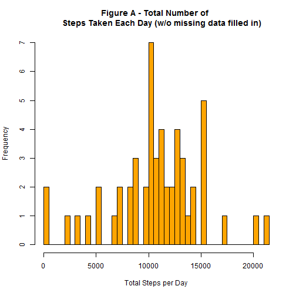
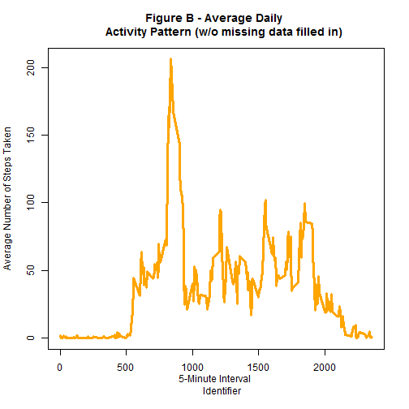
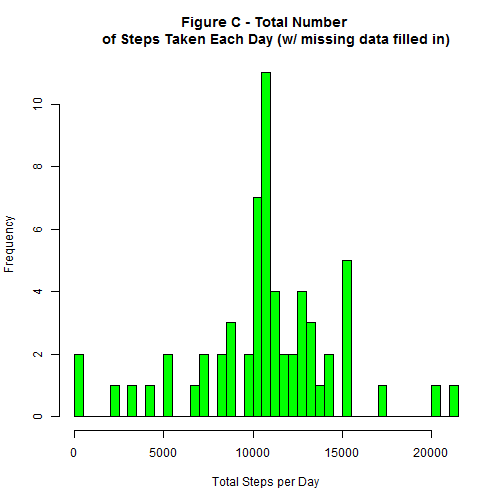
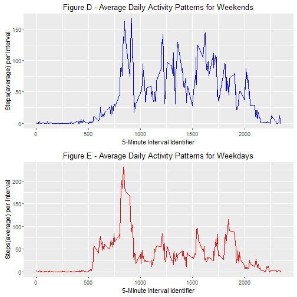
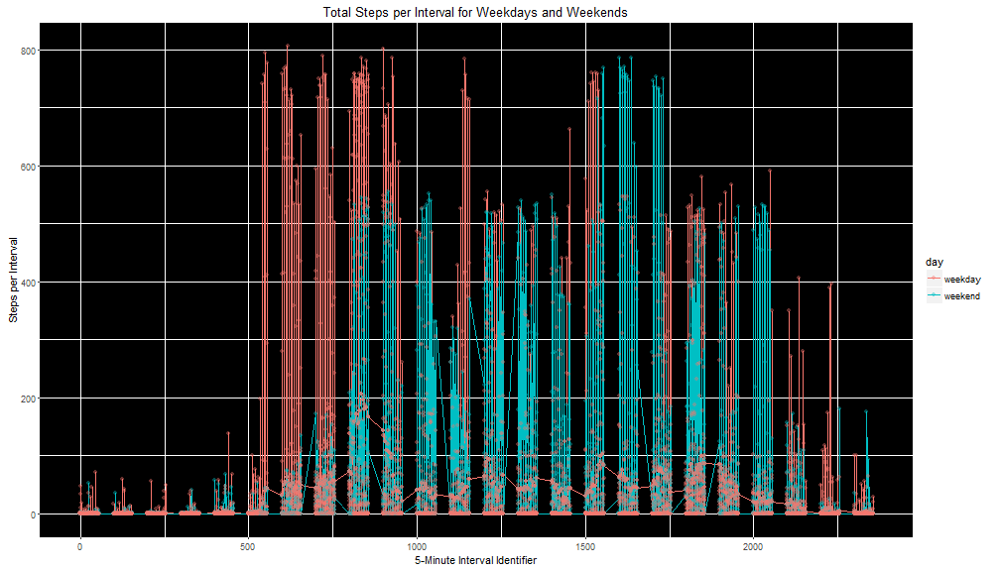

# Reproducible Research: Peer Assessment 1
Author: *Philip Abraham*  
Date: *August 17, 2016*


The data consists of two months of activity data from an anonymous individual 
collected during the months of October and November, 2012 and include the number 
of steps taken in 5 minute intervals each day.

## Loading and preprocessing the data
The dataset was forked from the [GitHub repository](https://github.com/rdpeng/RepData_PeerAssessment1) created for this project.
It is stored as a comma-separated-value (CSV) file, and there are a total of 
17568 activity observations within this dataset.

**Loaded the data (i.e. read.csv()).** 


```r
# unzip and read csv file into memory
unzip("./activity.zip")
act <- read.csv("./activity.csv", header  = TRUE)
```
**Processed/transformed the data into a format suitable for the analysis.**


```r
# transform date variable to date format
act$date <- as.Date(act$date)

head(act)
```

```
##   steps       date interval
## 1    NA 2012-10-01        0
## 2    NA 2012-10-01        5
## 3    NA 2012-10-01       10
## 4    NA 2012-10-01       15
## 5    NA 2012-10-01       20
## 6    NA 2012-10-01       25
```

```r
tail(act)
```

```
##       steps       date interval
## 17563    NA 2012-11-30     2330
## 17564    NA 2012-11-30     2335
## 17565    NA 2012-11-30     2340
## 17566    NA 2012-11-30     2345
## 17567    NA 2012-11-30     2350
## 17568    NA 2012-11-30     2355
```

```r
str(act)
```

```
## 'data.frame':	17568 obs. of  3 variables:
##  $ steps   : int  NA NA NA NA NA NA NA NA NA NA ...
##  $ date    : Date, format: "2012-10-01" "2012-10-01" ...
##  $ interval: int  0 5 10 15 20 25 30 35 40 45 ...
```

## What is mean total number of steps taken per day?

Note that there are a number of days/intervals where there are missing 
values (coded as NA). The presence of missing days may introduce bias into some calculations or summaries of the data.

A new dataframe was created with the missing values removed from the dataset.


```r
act_complete <- act[complete.cases(act),] #Removed missing values in the dataset
str(act_complete)
```

```
## 'data.frame':	15264 obs. of  3 variables:
##  $ steps   : int  0 0 0 0 0 0 0 0 0 0 ...
##  $ date    : Date, format: "2012-10-02" "2012-10-02" ...
##  $ interval: int  0 5 10 15 20 25 30 35 40 45 ...
```

```r
head(act_complete)
```

```
##     steps       date interval
## 289     0 2012-10-02        0
## 290     0 2012-10-02        5
## 291     0 2012-10-02       10
## 292     0 2012-10-02       15
## 293     0 2012-10-02       20
## 294     0 2012-10-02       25
```
The new dataset contains 15264 observations after the 
missing value rows were removed from the dataset.

**Generated a histogram (Figure A) of the total number of steps taken each day.**


```r
# computation of the total number of steps taken per day
sm_Total <- with(act_complete,tapply(steps,date, sum)) # missing values removed

# Histogram
hist(sm_Total, xlab='Total Steps per Day', main = 'Figure A - Total Number of 
     Steps Taken Each Day (w/o missing data filled in)',breaks = 40, 
     col = "orange")
```



**Calculated and reported the mean and median total number of steps taken per day.**


```r
options(scipen=999) # removes scientific notation in values
mn1 <- round(mean(sm_Total))
md1<- round(median(sm_Total))
```
The mean total number of steps taken per day is **10766**, and the median of 
the total number of steps taken per day is **10765**. 
The mean and median were calculated with the missing "steps" data values not 
filled in for the computations.

## What is the average daily activity pattern?

**Created a time series plot (Figure B) of the 5-minute interval (x-axis) and** 
**the average number of steps taken, averaged across all days (y-axis).**


```r
# computation of the average number of steps taken, per each time interval, 
# averaged across all the days
mn_Total <- aggregate(steps~interval,act_complete,mean,row.names=FALSE)

# Plot
plot(mn_Total$interval, mn_Total$steps,type = "l", main = "Figure B - Average Daily 
     Activity Pattern (w/o missing data filled in)", xlab="5-Minute Interval 
     Identifier", ylab="Average Number of Steps Taken", col="orange",lwd=3)
```



**Which 5-minute interval, on average across all the days in the dataset,** 
**contains the maximum number of steps?**


```r
m1 <- mn_Total[mn_Total$steps==max(mn_Total$steps),1]
```

The **835th** interval contains the maximum number of steps with 206 steps taken on the average at 
that interval.

## Imputing missing values

**Calculated and reported the total number of missing values in the dataset (i.e.** 
**the total number of rows with NAs).**


```r
m2 <- length(act$steps[is.na(act$steps)=="TRUE"])
```

There are a total of **2304** observations with missing values in the original 
dataset.

**Devised a strategy for filling in all of the missing values in the dataset.**

*Inputing Strategy* - The means for the 5-minute intervals were calculated, 
and those means were then used to fill in for the particular 5-minute interval with 
the missing values.


```r
act_NA <- act[!complete.cases(act),] # missing values dataset

# mean for the 5-minute interval filling in all of the missing values in dataset
act_interm <- merge(mn_Total,act_NA, by="interval") 

# cleaning up the variable names of act_interm data frame
act_interm<-act_interm[,c(2,4,1)]
names(act_interm)[names(act_interm)==
        "steps.x"] <- "steps" # cleaning variable names of act_interm dataframe

# round the value for the steps to zero digits
act_interm$steps <-round(act_interm$steps)
```
**Created a new dataset that is equal to the original dataset but with the** 
**missing data filled in.**


```r
# Combine act_interm & act_complete dataframes to create a new dataframe with 
# the missing data
act_new <- rbind(act_complete,act_interm)
act_new <- act_new[order(act_new$date),] # sort by date
head(act_new)
```

```
##    steps       date interval
## 1      2 2012-10-01        0
## 10     0 2012-10-01        5
## 17     0 2012-10-01       10
## 29     0 2012-10-01       15
## 33     0 2012-10-01       20
## 45     2 2012-10-01       25
```
**Made a histogram (Figure C) of the total number of steps taken each day, and calculated and reported the mean and median total number of steps taken per day.** 


```r
# histogram of the total number of steps taken each day with missing data 
# filled in
sm_Total_new <- with(act_new,tapply(steps,date, sum))
hist(sm_Total_new, xlab='Total Steps per Day', main = 'Figure C - Total Number 
     of Steps Taken Each Day (w/ missing data filled in)',
     breaks = 40, col = "green")
```




```r
# mean and median calcs
m3 <- round(mean(sm_Total_new)) # mean
m4 <- round(median(sm_Total_new)) # median
```

The mean and median total number of steps taken per day with the missing data 
filled in are:  
mean = **10766** steps  
median = **10762** steps  

**What is the impact of imputing missing data on the estimates of the total daily** 
**number of steps?**

The mean and median values calculated with the missing values inputed are almost
identical to the calculated values obtained without the missing values. Therefore,
either a different inputation strategy may be required, or the impact of the missing 
values on the mean/median calculations are negligible. 
Since the project did require a detailed/sophisticated inputation strategy,this 
was not further investigated at this time.

## Are there differences in activity patterns between weekdays and weekends?

**Created a new factor variable in the dataset with two levels -- "weekday" and** 
**"weekend" indicating whether a given date is a weekday or weekend day.**

The dataset with the filled-in missing values was used for this part.


```r
act_new$day <- factor(weekdays(act_new$date),ordered = TRUE)
levels(act_new$day) <- c("weekday","weekday","weekend","weekend","weekday",
                         "weekday","weekday")
head(act_new)
```

```
##    steps       date interval     day
## 1      2 2012-10-01        0 weekday
## 10     0 2012-10-01        5 weekday
## 17     0 2012-10-01       10 weekday
## 29     0 2012-10-01       15 weekday
## 33     0 2012-10-01       20 weekday
## 45     2 2012-10-01       25 weekday
```
**Made a panel plot containing a time series plot of the** 
**5-minute interval and the average number of steps taken, averaged** 
**across all weekend days (Figure-D) or weekday days (Figure E).**


```r
# dataframe for weekend days
mn_Total_wknd <- aggregate(steps~interval,act_new[act_new$day=="weekend",],
                           mean,row.names=FALSE)
# dataframe for weekday days
mn_Total_wkdy <- aggregate(steps~interval,act_new[act_new$day=="weekday",],
                           mean,row.names=FALSE)

# Install ggplot2 package for plotting
require("ggplot2") || install.packages("ggplot2")
```

```
## [1] TRUE
```

```r
library(ggplot2)

# Plot activity for weekends and weekdays
plotwknd <- ggplot(mn_Total_wknd, aes(interval, steps))+geom_line(color="blue", 
        lwd=.1) + ggtitle('Figure D - Average Daily Activity Patterns for Weekends') +
        labs(x="5-Minute Interval Identifier", 
             y="Steps(average) per Interval")
plotwkdy <- ggplot(mn_Total_wkdy, aes(interval, steps))+geom_line(color="red", 
        lwd=.1) + ggtitle('Figure E - Average Daily Activity Patterns for Weekdays') +
        labs(x="5-Minute Interval Identifier", 
             y="Steps(average) per Interval")

# Put plotwknd & plotwkdy on the same panel
# Install gridExtra package for multiplots
require("gridExtra") || install.packages("gridExtra")
```

```
## [1] TRUE
```

```r
library(gridExtra)
grid.arrange(plotwknd, plotwkdy, nrow=2)
```



Figure F shows an aggregate plot comparing the activity levels for weekdays and
weekends.


```r
# combine the two plots into one for total steps per day on weekends and weekdays
ggplot(act_new, aes(interval, steps, color=day))+geom_line(lwd=.01) + 
        geom_jitter(shape=16, position=position_jitter(1.5),alpha=0.4) +
        ggtitle('Total Steps per Interval for Weekdays and Weekends') +
        labs(x="5-Minute Interval Identifier", 
             y="Steps per Interval") +
        theme(panel.background = element_rect(fill = 'black'))
```



Some generalizations can be made about the weekend/weekday activity levels 
of the data subject.

1. The peak daily step activities appears to be more distributed through out the 
day on weekends compared to weekdays. See Figures D & E.
2. On weekdays, peak activity on the average occurs at the **835th** interval. And,
on weekends, that time of the peak activity shifts to later in the day towards the **915th** interval. See 
Figures D & E.
3. Overall, during the day, higher activity levels are seen on weekends compared 
to weekdays. See Figures D, E & F.


```r
## mean of total steps for weekend and weekdays
# weekend
wknd <- subset(act_new, act_new$day=='weekend') 
wknd_Total <- with(wknd,tapply(steps,date, sum))
mean_wknd <- round(mean(wknd_Total))

# weekday
wkdy<- subset(act_new, act_new$day=='weekday') 
wkdy_Total <- with(wkdy,tapply(steps,date, sum))
mean_wkdy <- round(mean(wkdy_Total))
```

On the average, during the two month data collection period, the 
data subject took 12201 steps per day on weekends, and 10255 
steps per day on weekdays.
```

